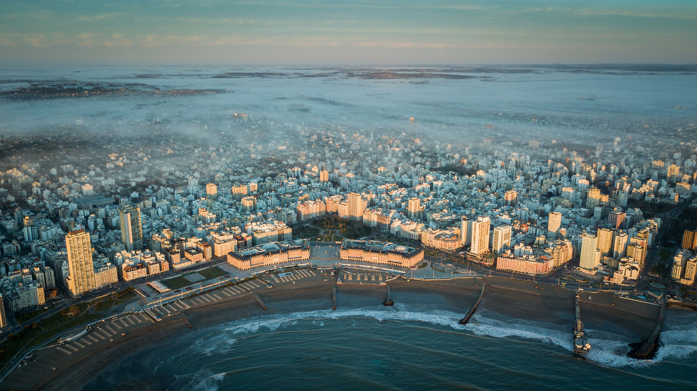

# About me

Lucas Martín Treser es mi nombre, vivo en la ciudad de [Mar del Plata](http://www.mardelplata.gov.ar/) (provincia de Buenos Aires, Argentina). Soy técnico electrónico y docente. Además tengo un blog desde enero de 2008 donde me encargo de todo: desde la edición y redacción de las publicaciones, hasta del mantenimiento del software (Wordpress y MySQL). Durante un tiempo fui moderador del extinto foro de electrónica [µControl](http://www.ucontrol.com.ar/forosmf/index.php), y colaborador en el diseño y diagramación de la revista digital µControl.

# Teaching

# Trainings
# Contributions
# Initiatives
# Publications

## Conferences
